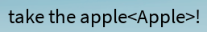
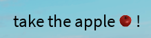

I made this really cool module that let's you customize your text, or precisely parts of your text, such that they have custom properties, or even custom effects, and look this beautiful:

<iframe width="1185" height="696" src="https://www.youtube.com/embed/luBkQ64iVpo" title="composite1" frameborder="0" allow="accelerometer; autoplay; clipboard-write; encrypted-media; gyroscope; picture-in-picture; web-share" allowfullscreen></iframe>

<iframe width="841" height="696" src="https://www.youtube.com/embed/BEFUlPdv6TQ" title="composite2" frameborder="0" allow="accelerometer; autoplay; clipboard-write; encrypted-media; gyroscope; picture-in-picture; web-share" allowfullscreen></iframe>


It can also have tags that get filled in later at runtime, for example to show a certain item:





At the moment it's as capable as Defaultio's Rich Text module, minus the easier use of interpreting tags in text, plus more control and extensibility.

And it works perfectly! It'll scale well, and it'll match the exact size and boundaries the original text had. It also doesn't eat performance at all.

<iframe width="1280" height="564" src="https://www.youtube.com/embed/ODW6oKdh7SY" title="composite3" frameborder="0" allow="accelerometer; autoplay; clipboard-write; encrypted-media; gyroscope; picture-in-picture; web-share" allowfullscreen></iframe>

It could be used for very immersive dialogue, showing more info on a shop, intriguing the player with cool effects, etc.

```lua
local UserInterfaceController = Knit.GetController("UserInterfaceController")
local TextLabel = PlayerGui:WaitForChild("ScreenGui").TextLabel2

local elements = {}
local ViewportComponent = require(UIComponents.ViewportComponent)

TextLabel.Text = TextLabel.Text:gsub("()<(.-)>", function(index, itemId)
	table.insert(elements, {Index = index, Element = ViewportComponent(ItemController:GetItemById(itemId).Model:Clone())})  -- here I insert item icons depending on where they pop up in the string
	return "" 
end)

local compositeText = UserInterfaceController.CompositeText.new(TextLabel)
compositeText.Parent = PlayerGui.ScreenGui

local tweenInfo = TweenInfo.new(3, Enum.EasingStyle.Sine, Enum.EasingDirection.Out, 1)
compositeText:ApplyEffect(UserInterfaceController.CompositeText.Effects.Lightsweep,49 , 54,{TweenInfo = tweenInfo})
compositeText:ApplyEffect(UserInterfaceController.CompositeText.Effects.Sparkling, 49 , 51,{TweenInfo = tweenInfo, Image = "http://www.roblox.com/asset/?id=10590233339", Rate = 1.2})
compositeText:ApplyEffect(UserInterfaceController.CompositeText.Effects.ApplyProperties, 49 , 53 ,{TextColor3 = Color3.fromRGB(255, 219, 11)})
compositeText:ApplyEffect(UserInterfaceController.CompositeText.Effects.Particles, 10 , 12,{TweenInfo = tweenInfo, Image = "http://www.roblox.com/asset/?id=10022661879"})
compositeText:ApplyEffect(UserInterfaceController.CompositeText.Effects.ApplyProperties, 10 , 12 ,{TextColor3 = Color3.fromRGB(11, 198, 255)})
-- applying some effects

for _, element in pairs(elements) do
	compositeText:AddElement(element.Element, element.Index)
end
```

After making this cleaner and easier to use I might make it public.